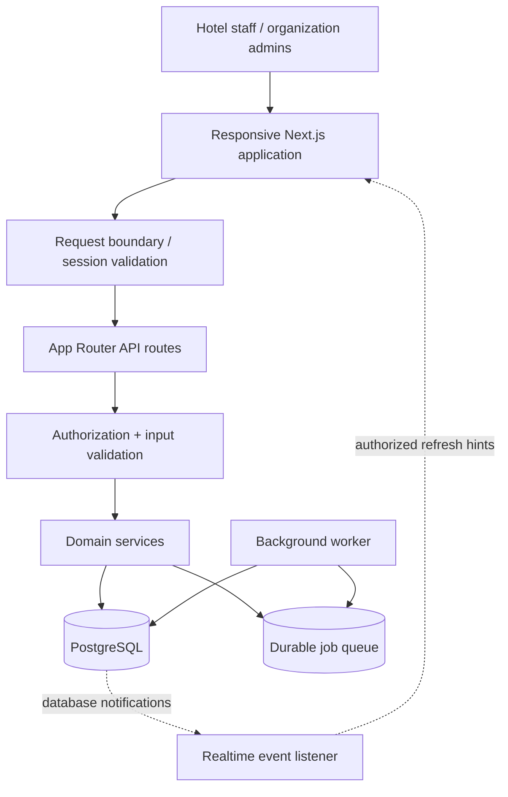
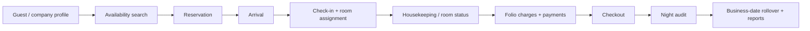

<div align="center">
  

  <p><strong>A unified operations workspace for modern hospitality teams.</strong></p>

  <p>
    <a href="https://github.com/syedasjadabbas/serene-management/actions/workflows/ci.yml"></a>
    
    
    
    
    
    
  </p>
</div>

---

## Overview

**SERENE MANAGEMENT** is a web-based Property Management System (PMS) for hotel organizations operating one or multiple properties. It brings front-office operations, reservations, guest profiles, rooms, housekeeping, billing, rates, reporting, and night audit into one permission-aware workspace.

The interface uses a clean, green-accented enterprise design system with responsive top navigation. The application is built around server-enforced permissions, property isolation, transaction-safe financial records, and an auditable operational history.

> **Project status:** Application code and workflows have been developed and tested. Hosting, DNS, TLS, production database operations, scheduled workers, backups, and monitoring must be configured for the target environment; this repository does not imply a publicly deployed service.

## Product areas

<table>
  <tr>
    <td width="50%" valign="top">
      <h3>🛎️ Front office</h3>
      Reservations, availability, arrivals, walk-ins, check-in/out, room assignment, room moves, stay extensions, and same-day reverse check-in where business rules permit.
    </td>
    <td width="50%" valign="top">
      <h3>👤 Guest relationships</h3>
      Guest profiles, stay history, preferences, notes, company accounts, contacts, groups, room blocks, and loyalty records.
    </td>
  </tr>
  <tr>
    <td width="50%" valign="top">
      <h3>🧹 Rooms & operations</h3>
      Room board, housekeeping task assignment and inspection, room readiness, maintenance requests, and out-of-order/out-of-service states.
    </td>
    <td width="50%" valign="top">
      <h3>💳 Revenue & billing</h3>
      Rate plans, seasonal rates, restrictions, packages, folio windows, charges, payments recorded by the system, adjustments, voids, refunds, and balances.
    </td>
  </tr>
  <tr>
    <td width="50%" valign="top">
      <h3>🌙 Night audit</h3>
      Readiness checks, queued audit execution, business-date rollover, run history, and recovery flows through the background worker architecture.
    </td>
    <td width="50%" valign="top">
      <h3>📊 Reporting & oversight</h3>
      Operational and financial reports, CSV export, organization-level views, user and role management, audit trail, and cross-property visibility where authorized.
    </td>
  </tr>
</table>

### At a glance

- **Multi-property:** organization-level oversight with property-scoped operational data.
- **Role-based access control:** navigation is permission-aware and every protected API operation is authorized server-side.
- **Auditable operations:** high-risk changes require reasons where defined by the workflow; audit history preserves the operational trail.
- **Data integrity:** PostgreSQL constraints and transactional service workflows protect important records.
- **Responsive UI:** desktop, tablet, and mobile layouts for operational screens.
- **Search and filters:** property-aware global search plus server-backed list filtering.
- **Realtime-capable:** selected operational boards can refresh from database-backed events when realtime is configured.
- **Offline mode:** a limited read-only snapshot for supported front-office views; offline writes are not supported.

## Visual architecture



### Typical hotel workflow



> The diagram illustrates the principal operational flow. Individual actions remain subject to the configured role permissions, property settings, room status, and business rules.

## Technology stack

| Layer | Technologies |
|---|---|
| Web application | Next.js 16 App Router, React 19, TypeScript strict mode |
| Styling and UI | Tailwind CSS v4, shared UI primitives, Lucide icons |
| State and data fetching | Redux Toolkit / RTK Query, Zustand |
| Validation | Zod |
| Database | PostgreSQL 17+ (tested with PostgreSQL 18) |
| ORM / migrations | Prisma 7 with `@prisma/adapter-pg` |
| Authentication | Server-validated sessions/tokens, secure-cookie behavior in production, Argon2 password hashing |
| Testing | Vitest, database-rule tests, API integration tests, browser QA |
| Operations | Compiled operational scripts for migrations, seed/bootstrap, backups, maintenance, posture checks, and workers |

## Architecture principles

- **Server-side authorization is authoritative.** Hiding a link or button is a usability feature, not the security boundary.
- **Property and organization scopes are enforced on the server.** A user must not gain access by editing a URL or API request.
- **Financial records are treated as auditable ledger activity.** Posted history should not be silently rewritten.
- **Concurrency is handled explicitly.** Critical mutations use transaction boundaries, state checks, versions, and idempotency mechanisms where implemented.
- **Background work is durable.** Long-running work such as night audit is processed by a separate worker rather than depending on a browser request remaining open.
- **Operational configuration is explicit.** Database pooling, realtime connections, worker execution, trusted proxy hops, and secrets must match the hosting environment.

## Getting started locally

### Prerequisites

- Node.js **22.12 or newer**
- Native PostgreSQL **17 or newer** with `psql` available
- Git
- Windows PowerShell is supported for the native PostgreSQL setup workflow
- **Docker is not required or used by the documented local setup**

### 1. Install dependencies

```powershell
npm ci
```

### 2. Create your local environment file

```powershell
Copy-Item .env.example .env
```

Edit `.env` locally. Set a valid `DATABASE_URL` for the local application role and generate distinct, strong authentication secrets. Never commit `.env` or paste secret values into issues, chat, or logs.

### 3. Prepare native PostgreSQL

Run the database setup script once. It creates or updates the application role and the development/test databases, prompting for the PostgreSQL administrator password when required.

```powershell
npm run db:setup
```

### 4. Apply migrations and seed reference data

```powershell
npm run db:deploy
npm run db:seed
```

`db:seed` loads reference data by default. To create the fictional demo organization locally, set `SEED_DEMO=true` and a strong `SEED_DEMO_PASSWORD` in `.env` before seeding. The demo seed is refused when `NODE_ENV=production`; do not use shared demo credentials for a public or production environment.

### 5. Start the development server

```powershell
npm run dev
```

Open [http://localhost:3000](http://localhost:3000).

### 6. Run the full verification suite

```powershell
npm run verify
```

This runs type generation/typecheck, lint, automated tests, and a production build. You can also run the individual scripts below.

## Useful scripts

| Command | Purpose |
|---|---|
| `npm run dev` | Start the Next.js development server |
| `npm run build` | Build the web application and operational scripts |
| `npm run start` | Start the application using the lifecycle-aware launcher |
| `npm run typecheck` | Generate route types and run TypeScript checks |
| `npm run lint` | Run ESLint and architecture-boundary rules |
| `npm run test` | Run the Vitest suites |
| `npm run verify` | Typecheck → lint → tests → production build |
| `npm run db:setup` | Prepare the native PostgreSQL role and local databases |
| `npm run db:deploy` | Apply existing migrations |
| `npm run db:seed` | Seed development/reference data |
| `npm run db:validate` | Validate the Prisma schema |
| `npm run ops:seed` | Seed production reference data from compiled ops scripts |
| `npm run ops:bootstrap` | Create the first organization and administrator during deployment setup |
| `npm run ops:db-check` | Check database posture and integrity settings |
| `npm run ops:backup` | Create, verify, list, and restore database backups |
| `npm run ops:maintenance` | Prune expired operational records |
| `npm run worker` | Run the durable background-job worker |

## Authentication, roles, and tenant boundaries

Users are assigned role templates at organization or property scope. The application computes the navigation appropriate to a user's grants, then independently checks permissions on server requests. Common roles include Organization Admin, General Manager, Front Office Manager, Front Desk Agent, Reservations Agent, Housekeeping Manager, Housekeeper, Maintenance Manager, Maintenance Staff, Cashier, Accountant, and Auditor.

- Organization-wide tools appear only for users with the relevant organization access.
- The property switcher is interactive when the account can access multiple properties; a single-property account may see a static property identity instead.
- Do not broaden navigation or API permissions just to make two accounts look the same. Expected navigation differs by role.
- High-risk operations may require a reason and create audit entries.

See [`docs/RBAC.md`](docs/RBAC.md) for the authoritative permissions catalog.

## Offline behavior

The offline experience is deliberately **read-only**. It can display the supported cached shell and limited, recently saved front-office snapshot when the connection is unavailable. Snapshots are scoped and have expiry/clearing rules.

The application does **not** support creating reservations, checking guests in or out, room moves, housekeeping writes, posting charges, processing payments, or running night audit while offline. Reconnect before performing operational writes.

Details: [`docs/OFFLINE_ARCHITECTURE.md`](docs/OFFLINE_ARCHITECTURE.md).

## Integrations and deployment considerations

The repository includes deployment and operations tooling, but successful local verification is not the same as a live production deployment. Before serving a real hotel, configure and validate the target environment's database, secrets, TLS, backups, monitoring, worker process, schedules, and recovery procedures.

Items that require separate infrastructure or client/provider configuration include:

- hosting, DNS, HTTPS/TLS, environment secrets, database operations, encrypted off-host backups, and monitoring;
- an always-on background worker for queued work such as night audit;
- realtime database connections and proxy behavior when realtime is enabled;
- email/SMS delivery for invitation and reset links (the current workflow can hand links to an administrator);
- payment-gateway/card-terminal processing, channel-manager connectivity, and accounting-system integration.

The application records supported payments in its own ledger; that is not the same as charging a card through a payment provider. Configure and test external integrations before representing them as active.

Deployment reference: [`docs/DEPLOYMENT.md`](docs/DEPLOYMENT.md) · Operations: [`docs/OPERATIONS.md`](docs/OPERATIONS.md).

## Documentation map

| Document | What it covers |
|---|---|
| [`docs/CLIENT_HANDOVER.md`](docs/CLIENT_HANDOVER.md) | User roles, setup order, daily operations, business rules, limitations, and dependencies |
| [`docs/ARCHITECTURE.md`](docs/ARCHITECTURE.md) | Application architecture, runtime, boundaries, and design decisions |
| [`docs/DOMAIN_MODEL.md`](docs/DOMAIN_MODEL.md) | Domain entities, relationships, and state machines |
| [`docs/DATABASE_DESIGN.md`](docs/DATABASE_DESIGN.md) | PostgreSQL/Prisma conventions and data-integrity rules |
| [`docs/PMS_WORKFLOWS.md`](docs/PMS_WORKFLOWS.md) | End-to-end hotel operational workflows |
| [`docs/API_CONVENTIONS.md`](docs/API_CONVENTIONS.md) | API shape, validation, errors, and conventions |
| [`docs/RBAC.md`](docs/RBAC.md) | Roles and permission catalog |
| [`docs/IMPLEMENTATION_ROADMAP.md`](docs/IMPLEMENTATION_ROADMAP.md) | Development phases and completion criteria |
| [`docs/DEPLOYMENT.md`](docs/DEPLOYMENT.md) | Environment setup, deployment, migrations, and bootstrap |
| [`docs/OPERATIONS.md`](docs/OPERATIONS.md) | Backups, restore drills, maintenance, monitoring, and runbooks |
| [`docs/PRODUCTION_READINESS.md`](docs/PRODUCTION_READINESS.md) | Production-readiness findings, prerequisites, and known risks |
| [`docs/SECURITY.md`](docs/SECURITY.md) | Security model and controls |
| [`docs/OFFLINE_ARCHITECTURE.md`](docs/OFFLINE_ARCHITECTURE.md) | Offline data scope, expiry, and security behavior |

## Project structure

```text
app/             Next.js pages, layouts, and API routes
components/      Shared UI and workspace components
hooks/           Shared client hooks
lib/              Cross-cutting utilities, API clients, and runtime helpers
modules/          Domain services, repositories, schemas, and policies
prisma/schema/    Database schema organized by domain
scripts/          Database setup, load tests, and operational tooling
tests/            Unit, database-rule, and integration tests
docs/             Architecture, workflows, security, deployment, and handover
```

## Contributing and change safety

1. Read [`docs/SERENE_MANAGEMENT_DEVELOPMENT_GUIDE.md`](docs/SERENE_MANAGEMENT_DEVELOPMENT_GUIDE.md) before changing the architecture.
2. Do not edit migrations that have already been applied; add a new migration when a schema change is required.
3. Preserve organization/property isolation and server-side authorization.
4. Keep financial operations auditable and exact; add meaningful regression tests for changes to money or booking workflows.
5. Run `npm run verify` before proposing a change.
6. Never commit `.env`, credentials, production connection strings, customer data, private keys, or generated backup files.

---

<div align="center">
  <strong>SERENE MANAGEMENT</strong><br />
  <sub>Hotel operations · Clear controls · Auditable workflows</sub>
</div>
