# SERENE MANAGEMENT — Domain Model

Functional reference: Oracle OPERA Cloud / OPERA PMS documentation (reservations, housekeeping & room management, cashiering & billing, end of day, blocks, profiles, rates). SERENE implements equivalent capabilities with its own model; no Oracle text, UI or code is reproduced.

Physical schema: [`prisma/schema/*.prisma`](../prisma/schema) (123 models). Table-level details: [DATABASE_DESIGN.md](./DATABASE_DESIGN.md).

---

## 1. Bounded contexts

```text
                       ┌─────────────────────────┐
                       │  Identity & Access      │ users, sessions, roles, permissions
                       └────────────┬────────────┘
                                    │ authorizes
┌──────────────┐        ┌───────────▼───────────┐        ┌───────────────────┐
│ Profiles     │◄───────┤  Property core         │───────►│ Rates & Inventory │
│ (org-wide)   │        │  org, property, codes, │        │ rate plans, seasons│
│ guests,      │        │  business date, rooms  │        │ restrictions,     │
│ accounts     │        └───────────┬────────────┘        │ packages, counters │
└──────┬───────┘                    │                     └─────────┬─────────┘
       │ books                      │ physical rooms                │ prices & sells
       ▼                            ▼                               ▼
┌───────────────────────────────────────────────────────────────────────────┐
│ Reservations & Front Office                                               │
│ reservation, reservation rooms, nights, assignments, stays, traces        │
└──────┬─────────────────────────┬──────────────────────┬──────────────────┘
       │ bills                   │ drives work          │ picks up from
       ▼                         ▼                      ▼
┌───────────────┐    ┌──────────────────────┐   ┌────────────────┐
│ Billing,      │    │ Housekeeping &        │   │ Groups & Blocks│
│ Payments,     │    │ Maintenance           │   └────────────────┘
│ Cashiering    │    └──────────────────────┘
└──────┬────────┘
       │ closes the day
       ▼
┌──────────────────┐     ┌───────────────────────────────────────────────┐
│ Night Audit      │────►│ Reporting (statistics snapshots, SQL reports) │
└──────────────────┘     └───────────────────────────────────────────────┘
 Modular add-ons (depend on core, core never depends on them): Commissions, Loyalty, Stock items.
 Future separate context: Sales & Catering (events, function spaces) — integrates via Blocks and Billing.
 Cross-cutting: Audit log, Outbox events, Attachments, Idempotency.
```

## 2. Scope rules

| Scope                                           | Entities                                                                                                                                                                                   |
| ----------------------------------------------- | ------------------------------------------------------------------------------------------------------------------------------------------------------------------------------------------ |
| **Organization** (shared by all its properties) | Organization, User, Role (org copies), Guest and its children, AccountProfile, PreferenceCode, VipLevel, Group, CommissionPlan, LoyaltyProgram, PaymentInstrument, StockItem               |
| **Property** (every row has `property_id`)      | everything operational: configuration, code tables, rooms, rates, inventory, reservations, stays, folios, payments, cashiering, housekeeping, maintenance, blocks, night audit, statistics |
| **Global**                                      | Permission, Currency, system Role templates                                                                                                                                                |

Guests are central so a returning guest is recognized at any property of the organization (Guide §26); property-specific facts about a guest (preferences, notes, stay statistics) carry an optional or required `property_id`.

## 3. Entity catalogue

Entities requested in the Phase 0 brief map to models as follows; **bold** entries were added by the domain analysis.

### 3.1 Tenancy & configuration

| Entity                       | Model                                         | Purpose                                                                                                                          |
| ---------------------------- | --------------------------------------------- | -------------------------------------------------------------------------------------------------------------------------------- |
| Organization                 | `Organization`                                | Tenant: hotel company.                                                                                                           |
| Property                     | `Property`                                    | A hotel; timezone, currency, check-in/out times.                                                                                 |
| **Property configuration**   | `PropertyConfiguration`                       | Typed operational switches (folio windows, overbooking, pickup/inspected statuses, no-show processing, zero-balance checkout …). |
| Building                     | `Building`                                    | Optional grouping of floors.                                                                                                     |
| Floor                        | `Floor`                                       | Physical level; housekeeping/assignment filter.                                                                                  |
| Business Date                | `BusinessDate`                                | Hotel accounting day; exactly one current per property.                                                                          |
| **Property sequence**        | `PropertySequence`                            | Gap-free counters: confirmation, cancellation, folio, invoice, receipt, maintenance numbers.                                     |
| **Currency / exchange rate** | `Currency`, `ExchangeRate`                    | ISO currencies with minor units; property-level rates for foreign-currency payments.                                             |
| Source                       | `SourceCode` (+ `AccountProfile` type SOURCE) | Where business came from (code) and, when commissionable, the source profile.                                                    |
| **Market segment**           | `MarketGroup`, `MarketCode`                   | Required segmentation on every booking/block; statistics dimension.                                                              |
| **Channel**                  | `Channel`                                     | Booking origin (front desk, web, GDS, channel manager).                                                                          |
| **Reason code**              | `ReasonCode`                                  | Mandatory reasons for high-risk actions (cancel, move, adjust, refund, OOO …).                                                   |

### 3.2 Identity & access

| Entity                   | Model                | Purpose                                                                            |
| ------------------------ | -------------------- | ---------------------------------------------------------------------------------- |
| User                     | `User`               | Staff login; belongs to one organization; `is_super_admin` for platform operators. |
| Role                     | `Role`               | Named permission set (system templates + organization roles).                      |
| Permission               | `Permission`         | `resource:action` catalog (code-owned, seeded).                                    |
| **Role permission**      | `RolePermission`     | Role ↔ permission.                                                                 |
| **User role assignment** | `UserRoleAssignment` | Grants a role organization-wide or for one property (property-level access).       |
| **Auth session**         | `AuthSession`        | Refresh-token family with rotation and reuse detection.                            |
| **Password reset token** | `PasswordResetToken` | Single-use, hashed.                                                                |
| Audit Log                | `AuditLog`           | Append-only record of every change.                                                |

### 3.3 Rooms

| Entity                   | Model                                   | Purpose                                                                                      |
| ------------------------ | --------------------------------------- | -------------------------------------------------------------------------------------------- |
| **Room class**           | `RoomClass`                             | Grouping above room type (e.g. Standard, Suites).                                            |
| Room Type                | `RoomType`                              | Sellable category; occupancy limits; pseudo types (posting masters) excluded from inventory. |
| Room                     | `Room`                                  | Physical room with four status axes (§5.2).                                                  |
| Room Status              | columns on `Room` + `RoomStatusHistory` | Current state + full history.                                                                |
| **Room feature**         | `RoomFeature`, `RoomFeatureAssignment`  | Balcony, view, bathtub… for preference matching.                                             |
| **Room connection**      | `RoomConnection`                        | Connecting / adjacent pairs.                                                                 |
| **Room component**       | `RoomComponent`                         | Component suites (suite deducts its component rooms).                                        |
| **Room condition**       | `RoomCondition`                         | Temporary condition (show room, minibar removed), optionally hides room from assignment.     |
| **Room service block**   | `RoomServiceBlock`                      | Out-of-order / out-of-service period with reason and return status.                          |
| **Room hold**            | `RoomHold`                              | Temporary hold of a specific room for a user / reservation.                                  |
| **Housekeeping section** | `HousekeepingSection`                   | Area used to build task sheets.                                                              |

### 3.4 Profiles

| Entity                              | Model                                                   | Purpose                                                                          |
| ----------------------------------- | ------------------------------------------------------- | -------------------------------------------------------------------------------- |
| Guest                               | `Guest`                                                 | Individual profile (central). Merge via `merged_into_id`; privacy anonymization. |
| Guest Document                      | `GuestDocument`                                         | Passport / national ID (CNIC) / licence; number encrypted.                       |
| Guest Preference                    | `GuestPreference` + `PreferenceCode`                    | Preferences and special-request catalog.                                         |
| **Guest contact / address / note**  | `GuestContact`, `GuestAddress`, `GuestNote`             | Contact channels, addresses, notes/alerts.                                       |
| **VIP level**                       | `VipLevel`                                              | Recognition level.                                                               |
| **Guest stay statistic**            | `GuestStayStatistic`                                    | Per-property stays, nights, revenue, first/last stay (recognition, history).     |
| Company                             | `AccountProfile` type COMPANY                           | Corporate account; AR number, credit limit, negotiated rates.                    |
| Travel Agent                        | `AccountProfile` type TRAVEL_AGENT                      | IATA, commission plan.                                                           |
| Source / OTA / wholesaler / partner | `AccountProfile` types SOURCE, OTA, WHOLESALER, PARTNER | Commissionable/contracted sources.                                               |
| **Account contact**                 | `AccountContact`                                        | Guest profile acting as contact for an account.                                  |

### 3.5 Rates, inventory & packages

| Entity                            | Model                                        | Purpose                                                                                                                                                                     |
| --------------------------------- | -------------------------------------------- | --------------------------------------------------------------------------------------------------------------------------------------------------------------------------- |
| **Rate category**                 | `RateCategory`                               | Grouping (with rate class) for reporting and restrictions.                                                                                                                  |
| Rate Plan                         | `RatePlan`                                   | Rate code: kind (BAR, corporate, group, package, promo, member…), currency, tax-inclusive flag, derivation, sell/stay windows, policies, commission.                        |
| Rate                              | `RateSeason` + `RateSeasonAmount`            | Prices per season/date range, day-of-week mask, priority; per room type and occupancy (1–4 adults, extra adult/child). Date-specific rates = one-day high-priority seasons. |
| **Rate plan room type**           | `RatePlanRoomType`                           | Where a rate plan is sellable.                                                                                                                                              |
| **Negotiated rate**               | `NegotiatedRate`                             | Account access to a negotiated rate plan.                                                                                                                                   |
| Availability                      | `RoomTypeInventory`, `HouseInventoryControl` | Daily counters per room type (physical, OOO, sold, blocked, overbook, sell limit) + house-level limits.                                                                     |
| **Restriction**                   | `Restriction`                                | Daily CLOSED / CTA / CTD / min-max LOS / stay-through / advance, by house, room type, rate plan.                                                                            |
| **Reservation (guarantee) type**  | `ReservationType`                            | Deduct vs non-deduct; card/deposit/ETA requirements; no-show charge.                                                                                                        |
| **Cancellation / deposit policy** | `CancellationPolicy`, `DepositPolicy`        | Deadline and penalty, deposit amount and due date.                                                                                                                          |
| Package                           | `Package`                                    | Sellable package (breakfast, half board, spa…), posting type.                                                                                                               |
| Package Component                 | `PackageComponent` + `PackageComponentPrice` | Posting element with transaction code, calculation, rhythm, allowance, seasonal price.                                                                                      |
| **Rate plan package**             | `RatePlanPackage`                            | Packages included in a rate plan.                                                                                                                                           |

### 3.6 Reservations & front office

| Entity                                       | Model                                                               | Purpose                                                                                                                                                                        |
| -------------------------------------------- | ------------------------------------------------------------------- | ------------------------------------------------------------------------------------------------------------------------------------------------------------------------------ |
| Reservation                                  | `Reservation`                                                       | The booking: confirmation number, booker, company/agent/source, group/block, channel, market, external reference.                                                              |
| Reservation Room                             | `ReservationRoom`                                                   | One room unit of a booking; **owns the reservation state machine**; dates, party, room type (booked vs rate), rate plan, guarantee, share group, discounts, cancellation data. |
| **Reservation room night**                   | `ReservationRoomNight`                                              | Per-night room type, rate plan and amount (multi-segment stays, daily overrides, night-audit posting source).                                                                  |
| Reservation Guest                            | `ReservationGuest`                                                  | Guests on a reservation room (primary + accompanying).                                                                                                                         |
| **Room assignment**                          | `RoomAssignment`                                                    | Physical room for `[from, to)`; history of moves/upgrades/swaps; exclusion constraint prevents conflicts.                                                                      |
| Stay                                         | `Stay`                                                              | Actual in-house occupancy (check-in → check-out); source of stay history.                                                                                                      |
| **Reservation package / fixed charge**       | `ReservationPackage`, `FixedCharge`                                 | Extra packages; recurring charges posted by night audit.                                                                                                                       |
| **Special request**                          | `ReservationSpecialRequest`                                         | Preference codes requested for this stay.                                                                                                                                      |
| **Note / alert / trace / message / wake-up** | `ReservationNote`, `ReservationTrace`, `GuestMessage`, `WakeUpCall` | Front-office communication.                                                                                                                                                    |
| **Deposit request**                          | `DepositRequest`                                                    | Deposit schedule; payments allocated against it.                                                                                                                               |
| **Turnaway**                                 | `Turnaway`                                                          | Regrets/denials for demand analysis.                                                                                                                                           |

### 3.7 Billing, payments & cashiering

| Entity                                               | Model                                                                      | Purpose                                                                                                                              |
| ---------------------------------------------------- | -------------------------------------------------------------------------- | ------------------------------------------------------------------------------------------------------------------------------------ |
| **Transaction code / group / tax rule**              | `TransactionCode`, `TransactionCodeGroup`, `TaxRule`, `TransactionCodeTax` | Chart of postable codes (revenue, payment, wrapper), revenue buckets, generated taxes/service charges, adjustment codes, GL mapping. |
| Folio                                                | `Folio`                                                                    | Billing window (1..n per reservation room) or group master / account / passer-by folio; payee; denormalized totals.                  |
| Folio Item                                           | `FolioItem`                                                                | Append-only ledger line.                                                                                                             |
| Charge                                               | `FolioItem` kind `CHARGE` (+ generated `TAX`)                              | Business term for a posted charge.                                                                                                   |
| **Routing instruction**                              | `RoutingInstruction`, `RoutingInstructionCode`                             | Automatic routing to another window, reservation room or folio by code/date/limit.                                                   |
| Payment                                              | `Payment`                                                                  | Payment or deposit; method, status, gateway reference, card brand/last4 only.                                                        |
| Refund                                               | `Refund`                                                                   | Refund against a payment (reason, approval).                                                                                         |
| **Payment method / instrument / card authorization** | `PaymentMethod`, `PaymentInstrument`, `CardAuthorization`                  | Method configuration, provider tokens, pre-authorizations.                                                                           |
| Invoice                                              | `Invoice`                                                                  | Immutable fiscal document (gap-free number, snapshot of bill-to and lines); credit notes.                                            |
| **Cashier shift / cash movement**                    | `CashierShift`, `CashMovement`                                             | Cashier session, float, drops, paid-outs, reconciliation.                                                                            |

### 3.8 Operations

| Entity                                     | Model                                               | Purpose                                                                                    |
| ------------------------------------------ | --------------------------------------------------- | ------------------------------------------------------------------------------------------ |
| Housekeeping Task                          | `HousekeepingTask` + `HousekeepingTaskType`         | Departure/stayover/deep/turndown/inspection/linen/minibar work per room per business date. |
| Housekeeping Assignment                    | `HousekeepingTaskSheet` (+ `HousekeepingAttendant`) | An attendant's sheet of tasks for a date, balanced by credits.                             |
| **Housekeeping discrepancy**               | `HousekeepingDiscrepancy`                           | Skip / sleep / person discrepancies.                                                       |
| **Lost & found**                           | `LostFoundItem`                                     | Found items lifecycle.                                                                     |
| Maintenance Request                        | `MaintenanceRequest` + `MaintenanceCategory`        | Room or area work order; may create a room service block.                                  |
| **Maintenance activity / preventive plan** | `MaintenanceActivity`, `PreventiveMaintenancePlan`  | Work history; scheduled preventive work.                                                   |

### 3.9 Groups, commercial, audit

| Entity                                | Model                                                                      | Purpose                                                                                                            |
| ------------------------------------- | -------------------------------------------------------------------------- | ------------------------------------------------------------------------------------------------------------------ |
| Group                                 | `Group`                                                                    | Organization-level group relationship (may span properties).                                                       |
| Room Block                            | `Block` + `BlockAllocation` + `BlockStatus`                                | Property inventory commitment; room type × night grid (allocated, picked up, released); configurable status types. |
| Commission                            | `Commission` + `CommissionPlan`                                            | Commission owed per reservation room to an agent/source.                                                           |
| Loyalty                               | `LoyaltyProgram`, `LoyaltyTier`, `LoyaltyMembership`, `LoyaltyTransaction` | Modular loyalty (internal or external program).                                                                    |
| **Night audit run / step**            | `NightAuditRun`, `NightAuditStep`                                          | Audit attempts and per-step results.                                                                               |
| **Daily statistics**                  | `DailyStatistic`, `DailyRoomTypeStatistic`                                 | Frozen statistics for closed dates (reports).                                                                      |
| **Stock item**                        | `StockItem`, `StockLocation`, `StockLevel`, `StockMovement`                | Minibar, amenities, linen, supplies.                                                                               |
| **Outbox / idempotency / attachment** | `OutboxEvent`, `IdempotencyKey`, `Attachment`                              | Events for real-time/integrations; request replay protection; files.                                               |

## 4. Relationships

### 4.1 Property core and rooms

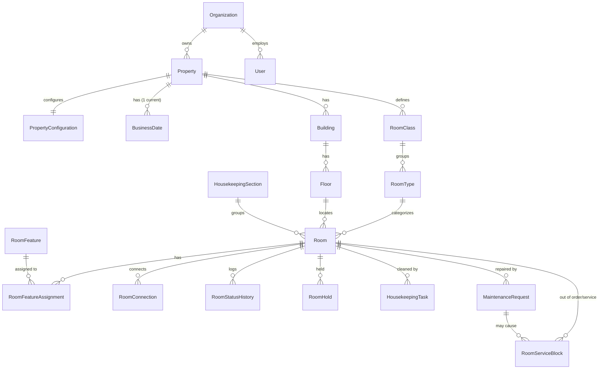

### 4.2 Rates and availability

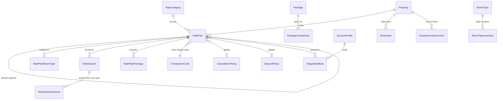

### 4.3 Reservation → stay → billing

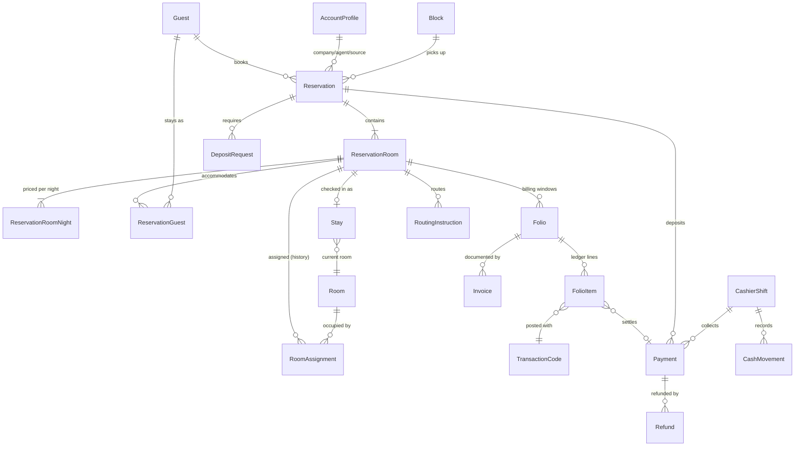

Key design notes:

- **Reservation → ReservationRoom → Room.** A booking has 1..n reservation rooms (multi-room). The assigned physical room is tracked by `RoomAssignment` rows over date ranges; `ReservationRoom.room_id` mirrors the currently active assignment for fast lists.
- **Reservation → Stay.** Check-in creates exactly one `Stay` per reservation room; `Stay.room_id` follows room moves.
- **Stay → Folio → FolioItem → Payment.** Folios belong to the reservation room (so deposits, no-show and cancellation fees exist without a stay) and are reachable from the stay through it. Payments post as `PAYMENT` ledger lines.
- **Room → Housekeeping / Maintenance.** Tasks and requests reference the room; a maintenance request can open a `RoomServiceBlock` (OOO/OOS) which updates inventory.
- **Property → Rooms / Rates / Availability.** All property-scoped; composite FKs forbid mixing properties.
- **Guest → Reservations / Stay history.** Guest links to reservations (booker), reservation rooms (primary guest), reservation guests (sharers), stays and the per-property `GuestStayStatistic`.

### 4.4 Groups, operations, commercial

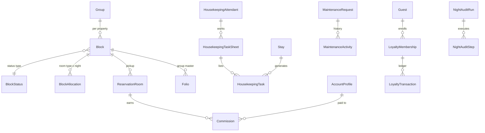

## 5. Core concepts

### 5.1 Reservation status and derived states

Stored on `ReservationRoom.status`: `WAITLISTED, RESERVED, IN_HOUSE, CHECKED_OUT, CANCELLED, NO_SHOW`.
Derived at read time from the property business date `D`:

| Display          | Rule                                |
| ---------------- | ----------------------------------- |
| Due in           | `RESERVED` and `arrival_date = D`   |
| Arrival (future) | `RESERVED` and `arrival_date > D`   |
| Due out          | `IN_HOUSE` and `departure_date = D` |
| Stayover         | `IN_HOUSE` and `departure_date > D` |
| Day use          | `is_day_use` (arrival = departure)  |

Booking-level status is not stored; it is derived from its rooms (e.g. "partially checked in").

**Booking state (implemented in Phase 2).** Tentative versus confirmed is not a separate status: it is whether the reservation (guarantee) type deducts inventory. `bookingState` in `modules/reservations/reservations.policy.ts` derives the state shown to staff:

| Booking state                                | Stored as                                                          |
| -------------------------------------------- | ------------------------------------------------------------------ |
| Waitlisted                                   | `WAITLISTED` (never holds inventory)                               |
| Tentative (hold)                             | `RESERVED` + non-deducting reservation type (e.g. `TENT`)          |
| Confirmed                                    | `RESERVED` + deducting reservation type (`GTD`, `6PM`, `COMP` ...) |
| In house / checked out / cancelled / no-show | `IN_HOUSE` / `CHECKED_OUT` / `CANCELLED` / `NO_SHOW`               |

"Inquiry" is an availability search (optionally a turnaway), not a stored reservation. **Confirm** is the command that moves a tentative or waitlisted reservation to a deducting type, taking inventory under lock.

### 5.2 Room status (four independent axes)

| Axis          | Column                 | Values                                               | Changed by                                                           |
| ------------- | ---------------------- | ---------------------------------------------------- | -------------------------------------------------------------------- |
| Housekeeping  | `housekeeping_status`  | CLEAN, DIRTY, PICKUP*, INSPECTED*                    | housekeeping, check-out, night audit (stayovers → DIRTY), inspection |
| Front office  | `front_office_status`  | VACANT, OCCUPIED                                     | check-in, check-out, reinstate, room move (never manual)             |
| Service       | `service_status`       | IN_SERVICE, OUT_OF_ORDER, OUT_OF_SERVICE             | room service blocks (activation / release)                           |
| Guest service | `guest_service_status` | NONE, DO_NOT_DISTURB, MAKE_UP_ROOM, SERVICE_DECLINED | guest request / housekeeping                                         |

\* optional per `PropertyConfiguration`.

Derived **display status** (room rack / board), in priority order:

1. `OUT_OF_ORDER` → **OOO**; `OUT_OF_SERVICE` → **OOS**
2. Active hold → **Hold**
3. Open maintenance request on the room → **Maintenance** flag (overlay, not exclusive)
4. `front_office_status × housekeeping_status` → **Vacant Clean / Vacant Dirty / Vacant Inspected / Vacant Pickup / Occupied Clean / Occupied Dirty …**

Inventory effect: **OOO removes the room from sellable inventory** (`room_type_inventory.out_of_order`); **OOS does not** (room stays sellable and assignable with warning).

### 5.3 Inventory model

`available(room type, night) = physical − out_of_order − sold − blocked + overbook_limit`, capped by `sell_limit` and the house-level controls. `sold` counts deducting reservation-room nights outside blocks; `blocked` counts un-picked-up allocation of deducting blocks; block pickup moves a unit from `blocked` to the block's `picked_up` without changing availability. Non-deducting reservation types (tentative, waitlist) never touch counters. Counters change only inside the transaction that changes their source rows and are reconciled nightly.

**As implemented (Phase 2):** the source of truth for `sold` is the reservation nights themselves (`reservation_room_nights` of `RESERVED`/`IN_HOUSE` rooms with a deducting type), and `physical` / `out_of_order` are counted live from `rooms` and `room_service_blocks`. The `room_type_inventory` row for each (room type, night) is the **serialization point**: every inventory-changing command inserts missing rows, locks them `FOR UPDATE` in (room type, date) order, re-counts from the source rows, and after writing its nights rewrites the cached counters of those rows. Availability search reads the source rows directly (always exact); the cached counters serve reports and future channel pushes.

### 5.4 Billing model

- Transaction code hierarchy: group (REVENUE / PAYMENT / WRAPPER) → subgroup → code; each code has a revenue bucket, tax generates, adjustment code, deposit/cancellation-rule inclusion flags.
- A charge posting inserts the charge line and its generated tax/service lines (`parent_item_id`) in one transaction, after resolving routing.
- Sign: charges positive, payments/credits negative; `folio.balance = charges_total + credits_total = SUM(amount)`.
- Corrections never edit rows: `REVERSAL` (exact negation, same business date), `ADJUSTMENT` (prior-date correction using the adjustment code, with reason), `TRANSFER_OUT/IN` pairs (move/split between folios).
- Deposits are payments of kind `DEPOSIT` held against the reservation (deposit ledger) and transferred to the guest folio at check-in (`DEPOSIT_TRANSFER`).

## 6. State machines

Transitions are implemented as pure functions in `modules/<domain>/<domain>.policy.ts` (shared by server and UI) and enforced in services; the database backs the critical ones with constraints. Any transition not listed is **prohibited** and returns `INVALID_STATE_TRANSITION`.

### 6.1 Reservation (ReservationRoom)

```mermaid
stateDiagram-v2
  [*] --> WAITLISTED: create (no availability)
  [*] --> RESERVED: create
  WAITLISTED --> RESERVED: accept (availability rechecked)
  WAITLISTED --> CANCELLED: cancel
  RESERVED --> IN_HOUSE: check-in (arrival = business date)
  RESERVED --> CANCELLED: cancel
  RESERVED --> NO_SHOW: night audit / manual (arrival ≤ business date)
  IN_HOUSE --> RESERVED: reverse check-in (same business date, no postings)
  IN_HOUSE --> CHECKED_OUT: check-out (zero balance on all windows)
  CHECKED_OUT --> IN_HOUSE: reinstate (same business date, before audit)
  CANCELLED --> RESERVED: reinstate (arrival ≥ business date, availability)
  NO_SHOW --> RESERVED: reinstate (departure > business date; arrival := business date)
```

| From        | Allowed to  | Guard                                                                                         | Permission                   |
| ----------- | ----------- | --------------------------------------------------------------------------------------------- | ---------------------------- |
| WAITLISTED  | RESERVED    | availability & restrictions pass                                                              | reservations:waitlist        |
| WAITLISTED  | CANCELLED   | reason                                                                                        | reservations:cancel          |
| RESERVED    | IN_HOUSE    | arrival = D (early arrival: change arrival first), room assigned & ready, guarantee satisfied | frontdesk:checkin            |
| RESERVED    | CANCELLED   | reason; deposit handled per config                                                            | reservations:cancel          |
| RESERVED    | NO_SHOW     | arrival ≤ D; normally by night audit                                                          | reservations:no_show         |
| IN_HOUSE    | RESERVED    | checked in on D, no postings, no deposit transferred                                          | frontdesk:reverse_checkin    |
| IN_HOUSE    | CHECKED_OUT | departure ≤ D (early departure: shorten first), every window balance = 0 (or routed to AR)    | frontdesk:checkout           |
| CHECKED_OUT | IN_HOUSE    | checked out on D, audit not yet run, room still vacant (else share)                           | frontdesk:reinstate_checkout |
| CANCELLED   | RESERVED    | arrival ≥ D, availability rechecked (override needs permission)                               | reservations:reinstate       |
| NO_SHOW     | RESERVED    | departure > D; arrival reset to D                                                             | reservations:reinstate       |

**Prohibited** (examples): IN_HOUSE → CANCELLED (use check-out / reverse check-in); CHECKED_OUT → CANCELLED/NO_SHOW; NO_SHOW → IN_HOUSE directly; CANCELLED → IN_HOUSE; any transition on a closed business date; any change to a CHECKED_OUT reservation other than reinstate on the same day; changing arrival date of an IN_HOUSE reservation.

### 6.2 Room

Front office status (derived, not user-editable): VACANT → OCCUPIED (first guest checks in) → VACANT (last sharer checks out / moves out).

Housekeeping status:

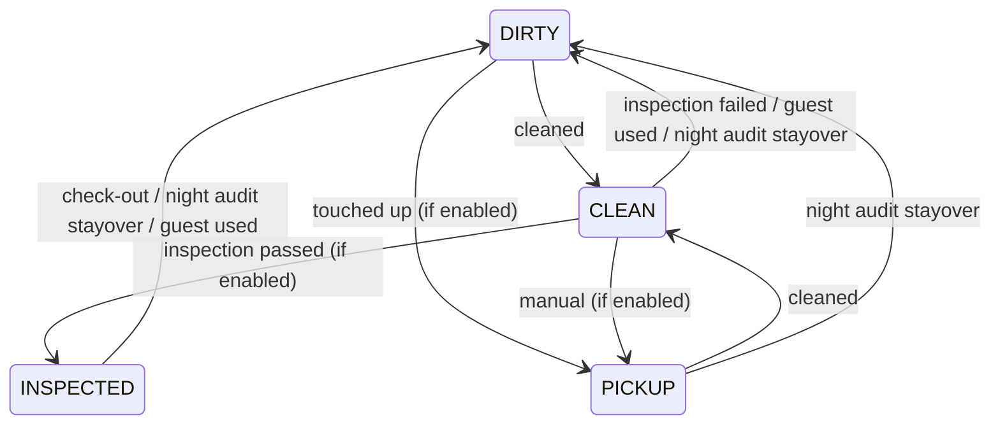

Service status:

| From                          | To             | Guard                                                                                                                             |
| ----------------------------- | -------------- | --------------------------------------------------------------------------------------------------------------------------------- |
| IN_SERVICE                    | OUT_OF_ORDER   | no active assignment/stay overlapping the period (move guests first); reason; inventory `out_of_order` incremented for the period |
| IN_SERVICE                    | OUT_OF_SERVICE | reason; warning if assigned                                                                                                       |
| OUT_OF_ORDER / OUT_OF_SERVICE | IN_SERVICE     | release or night audit on `to_date`; housekeeping status := block's return status                                                 |

Prohibited: setting OCCUPIED/VACANT manually; marking an occupied room OOO; CLEAN → INSPECTED without `housekeeping:inspect`; any status change on inactive rooms.

### 6.3 Stay

| From        | To              | Trigger                                                                                     |
| ----------- | --------------- | ------------------------------------------------------------------------------------------- |
| —           | IN_HOUSE        | check-in (creates row)                                                                      |
| IN_HOUSE    | CHECKED_OUT     | check-out                                                                                   |
| CHECKED_OUT | IN_HOUSE        | same-day reinstatement (`reinstated_count` +1)                                              |
| IN_HOUSE    | — (row removed) | reverse check-in on the same business date with no postings; the audit log keeps the record |

Room moves update `room_id` without changing status. Prohibited: CHECKED_OUT → IN_HOUSE after the business date closed.

**As implemented (Phase 3).** There is no stored "expected" stay: a due-in guest is a `RESERVED` reservation room with an inventory-deducting type and `arrival_date = D`; the `Stay` row is created by check-in. Check-in (`RESERVED → IN_HOUSE`) requires a confirmed reservation, `arrival = D < departure`, and a room of the booked type that is not out of order, vacant (the previous guest has checked out) and clean — or inspected when `requireInspectedForCheckIn` — for the whole stay; a dirty / uninspected room needs `rooms:update_status` and a reason (HIGH audit). Check-out (`IN_HOUSE → CHECKED_OUT` on both the stay and the reservation room) records `checked_out_at` and `departure_business_date = D`, ends the room assignment at D and sets the room VACANT + DIRTY. An early departure (departure > D, at least one night used) is confirmed explicitly with an `EARLY_DEPARTURE` reason code: the unused nights are deleted and their inventory released in the same transaction. A guest who checked in on D cannot be checked out (reverse check-in, `frontdesk:reverse_checkin`, is deferred). Room moves close the current assignment at D (its range keeps the nights spent in the old room), add a `MOVE` assignment `[D, departure)` for a room of the same type, and set the old room VACANT + DIRTY. Upgrades, extensions, reverse check-in and same-day reinstatement are deferred.

Database guards: `stays_one_in_house_per_room` (at most one in-house stay per room) and `stays_checkout_chk` (check-out fields set together, only when checked out).

### 6.4 Folio

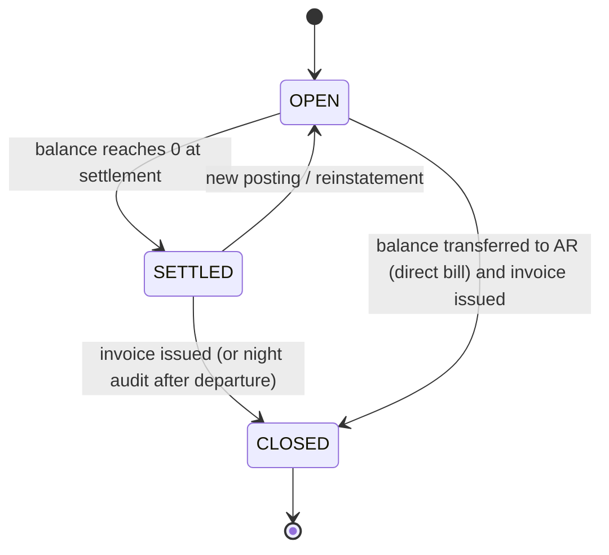

CLOSED is terminal (trigger rejects postings). Corrections to a closed folio are made by a credit note plus postings on a new folio. Prohibited: closing with non-zero balance; deleting folios; posting to another property's folio.

### 6.5 Payment

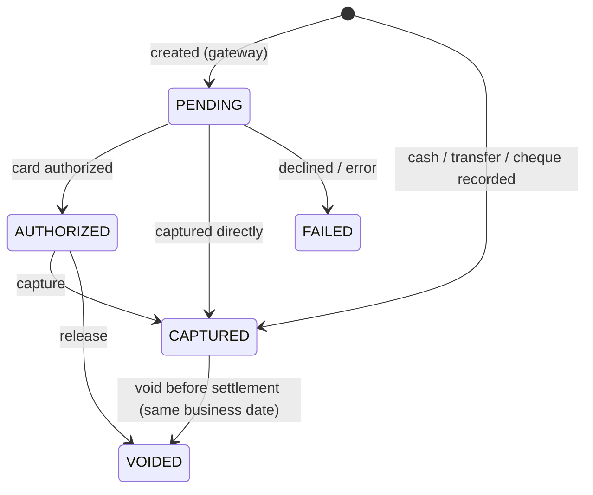

Refunds are separate `Refund` rows (PENDING → SUCCEEDED | FAILED) against a CAPTURED payment; `payments.refunded_amount ≤ amount` (DB check). Prohibited: refunding FAILED/VOIDED payments; voiding after the business date closed (use refund); changing amount after capture.

### 6.6 Housekeeping task

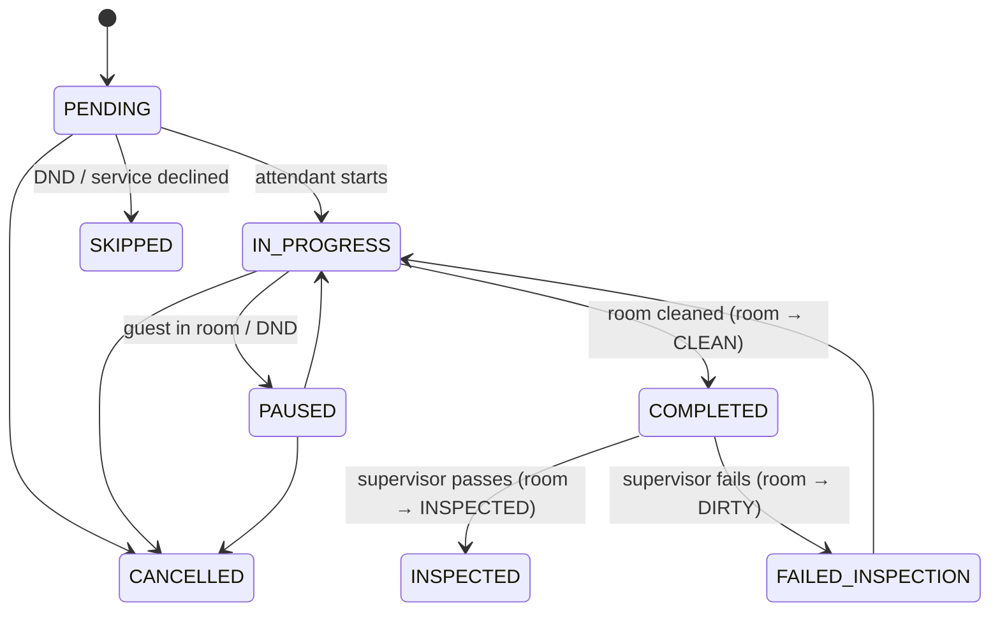

COMPLETED is terminal when the task type does not require inspection. Tasks belong to one business date; night audit cancels leftovers and generates the next day's tasks.

**As implemented (Phase 4).** Tasks are worked by system users: the attendant roster (`housekeeping_attendants`) holds one row per user and property, created on first assignment; assignees must hold `housekeeping:update` at the property (checked in the database, never by role name). The assigned attendant or a supervisor (`housekeeping:assign`) works a task; anyone with `housekeeping:update` may take an unassigned task by starting it. Deviations from the diagram: a task IN_PROGRESS cannot be cancelled (pause first); inspection outcomes are driven by the room inspection command, which also sets the awaiting task to INSPECTED / FAILED_INSPECTION. A cleaning task type that changes room status turns a DIRTY/PICKUP room CLEAN on completion; the room is **ready** only when the readiness rule says so (INSPECTED when `requireInspectedForCheckIn`). Check-out, room moves (vacated room) and returns to service queue the departure clean (`DEP`) in their own transaction; its priority is URGENT when a guest arrives in the room today, PRIORITY after maintenance / out of order, NORMAL otherwise. Open tasks of earlier business dates stay visible until night audit exists.

**Room readiness (Phase 4).** `rooms.policy.roomReadiness` combines the three axes: out of order (block covering D) → OUT_OF_ORDER; occupied → OCCUPIED; out of service → OUT_OF_SERVICE (usable only with an audited override); then housekeeping: INSPECTED → READY, CLEAN → READY or NOT_INSPECTED, DIRTY/PICKUP → DIRTY. Check-in, room moves and the room board all use it. Service blocks are the source of truth for out-of-order / out-of-service; `rooms.service_status` mirrors a block that covers the business date (placed or released today) and is recorded in `room_status_history` (field SERVICE).

### 6.7 Maintenance request

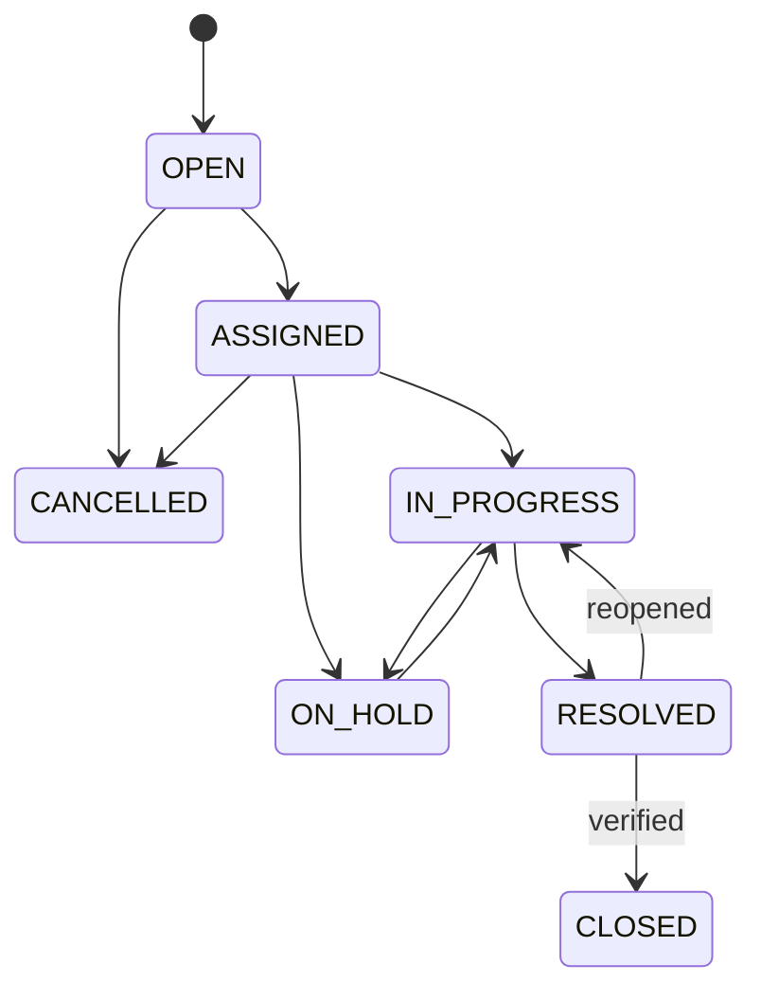

Resolving a request linked to an active room service block prompts release of the block (the room returns to service with its return status).

**As implemented (Phase 4).** A request never changes room readiness by itself. A blocking issue places an out-of-order / out-of-service block linked to the request (`rooms:out_of_order`, HIGH audit), at creation or later. Resolving with "return to service" releases the linked blocks: the room comes back DIRTY with a priority cleaning task, so it is ready only after housekeeping and inspection. A request with a live block cannot be cancelled. Hold is allowed from IN_PROGRESS only. Priorities LOW / NORMAL / HIGH / URGENT ("critical" = URGENT) order every list. Request numbers come from the property sequence `maintenance` (`M1000`, `M1001`, …).

### 6.8 Group / block

Group: ACTIVE → CLOSED | CANCELLED.

Block status follows the configured `BlockStatus.type`:

| From type  | To type                    | Guard / effect                                                                                                    |
| ---------- | -------------------------- | ----------------------------------------------------------------------------------------------------------------- |
| INQUIRY    | NON_DEDUCT, DEDUCT, CANCEL | DEDUCT: allocations move into `room_type_inventory.blocked` (availability check, override permission to overbook) |
| NON_DEDUCT | DEDUCT, CANCEL             | same as above                                                                                                     |
| DEDUCT     | NON_DEDUCT                 | only with zero pickup; releases `blocked`                                                                         |
| DEDUCT     | CANCEL                     | only with zero pickup (cancel reservations first); releases `blocked`                                             |
| CANCEL     | —                          | terminal                                                                                                          |

Cutoff and wash release un-picked-up allocation back to house (`released`), irreversibly.

### 6.9 Night audit run

RUNNING → COMPLETED | FAILED. A FAILED run is terminal; a retry creates a new run (`attempt` + 1). At most one RUNNING run per property (unique index). Steps: PENDING → RUNNING → SUCCEEDED | FAILED | SKIPPED.

### 6.10 Business date

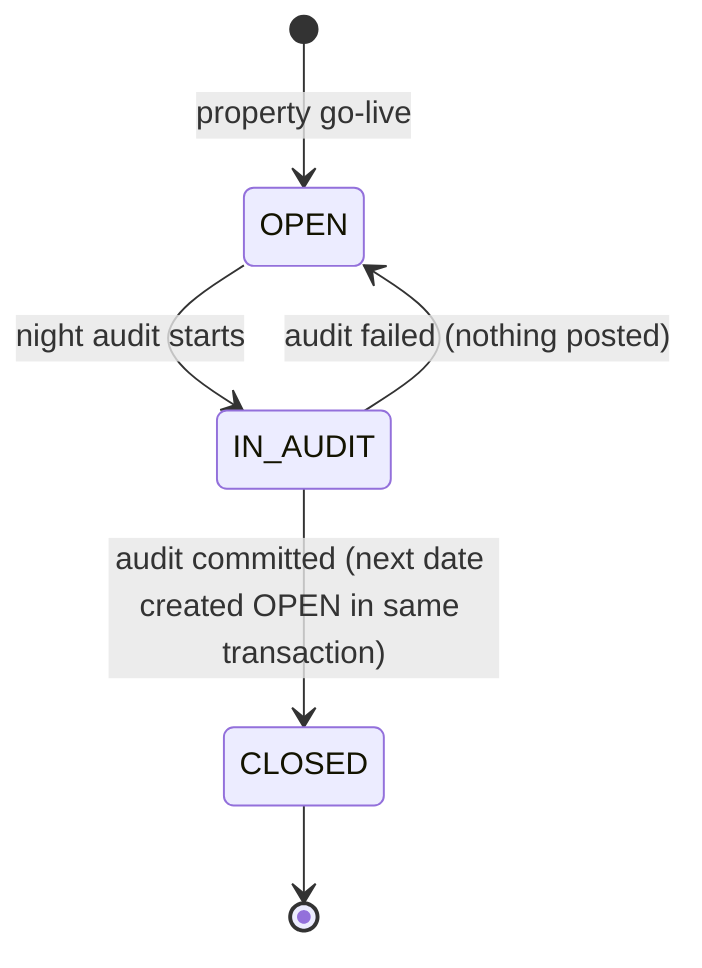

Exactly one OPEN/IN_AUDIT row per property (`is_current` unique index); CLOSED rows are frozen by trigger. Prohibited: skipping dates, reopening a closed date, closing out of order.
